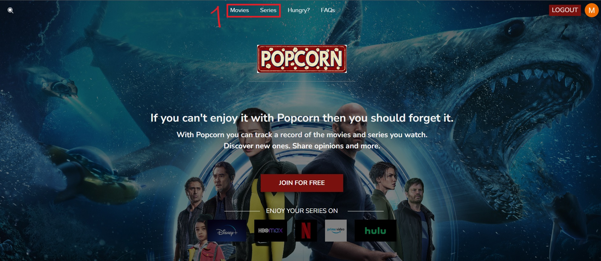
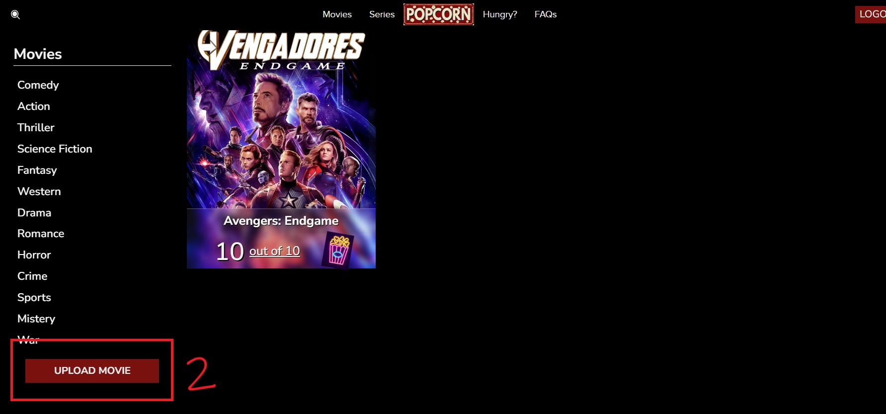
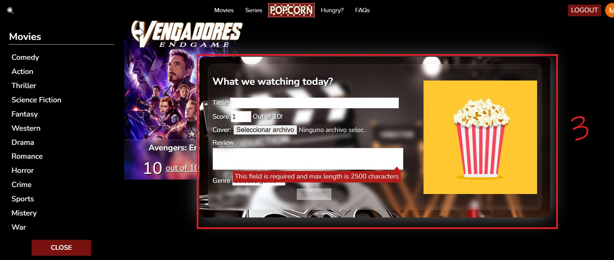
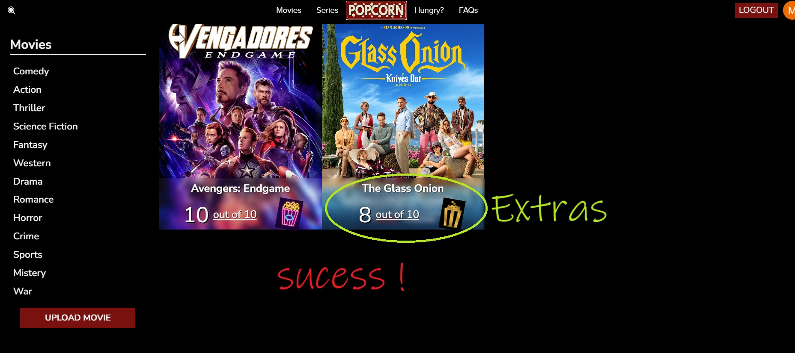

# Welcome to MovieHub!

Hi! I'm Matias. 
This page was made as a project for Assembler Institute.
I will use this readMe to explain a few things about the project.

# Basic Structure

The project is separated in two folders, server (backend) and client (frontend).
You can execute both using 'npm run dev'
Server is prepared for development enviroment at port 8080
Client will run at port 5173

# How to use the page

## Step 1: Access our page
You can access to the Movies or Series tag by logging in, there you will be able to load your favourites movies!

## Step 2: Load something
By pressing UPLOAD a modal will open so you can fill the data of the media you will upload!

## Step 3: Fill the data
Fill the tittle, score, review, and image field, pick a genre and upload your critique. It will take a few seconds to reload.

## Step 4: Success!
You did it! Now you can do the same as many times you want. You can also press en the card to see details, edit or even delete your reviews.
